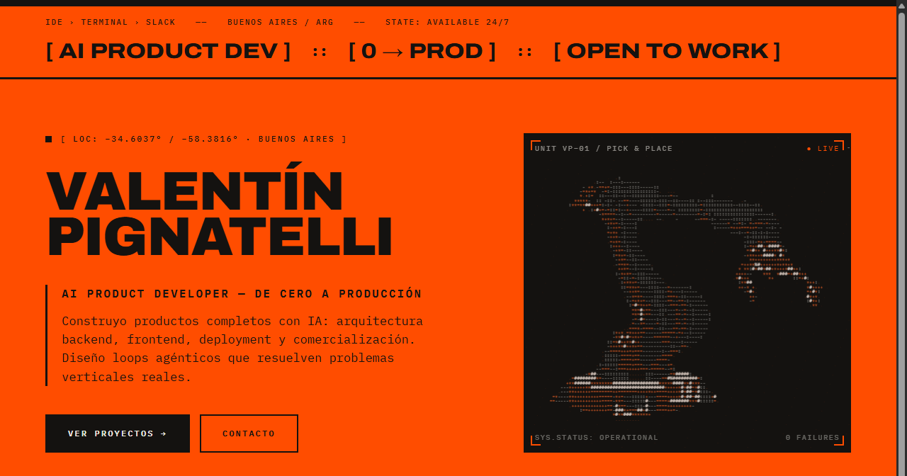

# Valentín Pignatelli — Portfolio

Personal portfolio with a neo-industrial design system. Built with Astro and Tailwind CSS, shipped as a fully static site.



**Live:** _coming soon_ · **Español:** `/es/`

## Stack

- [Astro](https://astro.build) 5 — static output, zero JS by default
- Tailwind CSS 4 (via `@tailwindcss/vite`)
- TypeScript for the canvas animations
- No UI frameworks, no component libraries

## Features

- **EN/ES i18n** — English by default, Spanish at `/es/`. Copy lives in each component as a typed `lang` prop dictionary; markup is shared, so both languages can't drift apart.
- **Canvas animations** — the hero's ASCII robotic arm and the conveyor belt are hand-written 2D canvas loops (`src/scripts/`), DPR-aware and cleaned up on unload.
- **Copy-to-clipboard contact** — no jarring `mailto:` handoffs; the email CTA writes to the clipboard with visual feedback and falls back to `mailto:` only when the Clipboard API is unavailable.
- **Screenshot lightbox** — product captures open in an in-page overlay (ESC / backdrop / button to close), with plain `<a>` fallbacks if JS fails.
- **Variable font typography** — Archivo's `wght`/`wdth` axes drive the display hierarchy instead of multiple font files.
- **OG / Twitter cards, SVG favicon, WebP assets** — link previews and image weight taken care of.

## Structure

```
src/
├── components/   # one .astro component per section, ES/EN copy inline
├── layouts/      # Base.astro — head, meta, fonts
├── pages/        # index.astro (EN) · es/index.astro (ES)
├── scripts/      # canvas animations (robotic arm, conveyor, ascii loop)
└── styles/       # Tailwind global styles
```

---

**Valentín Pignatelli** — Full Stack & AI Product Developer, Buenos Aires
[LinkedIn](https://www.linkedin.com/in/valentin-pignatelli-47b379275/) · dev.valentinpignatelli@gmail.com
